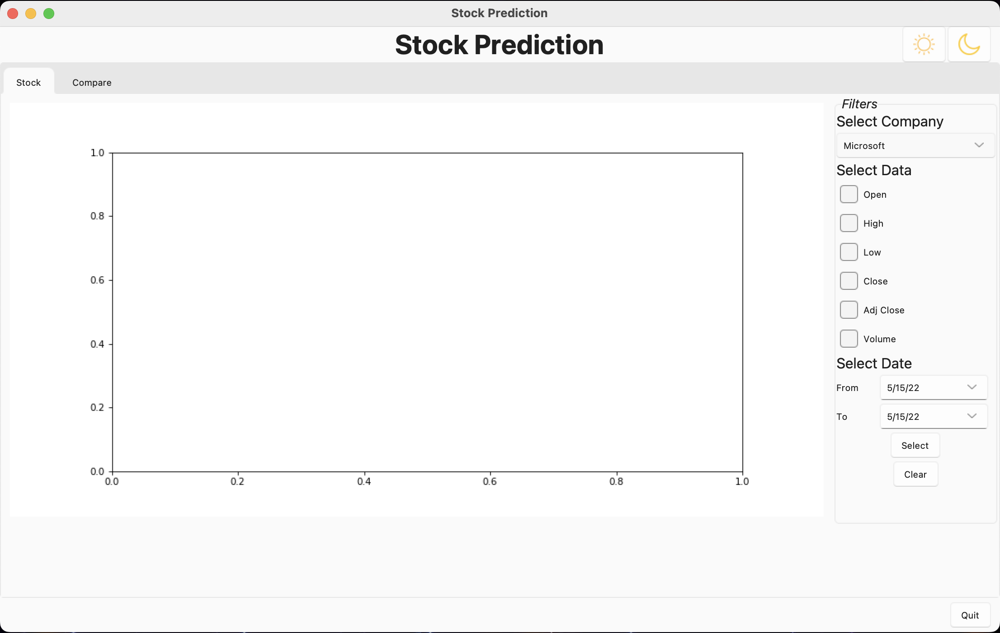
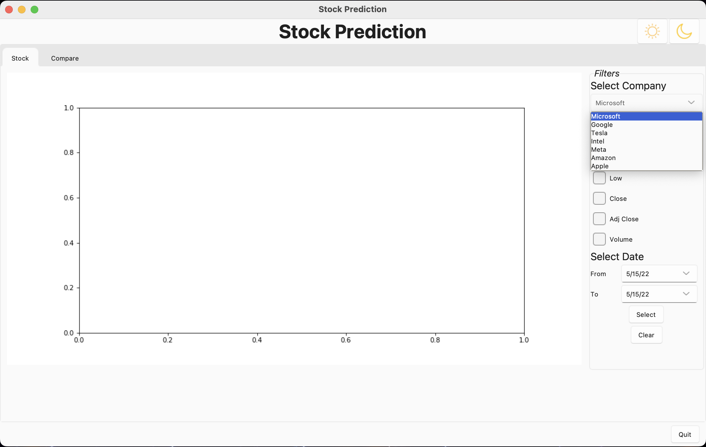
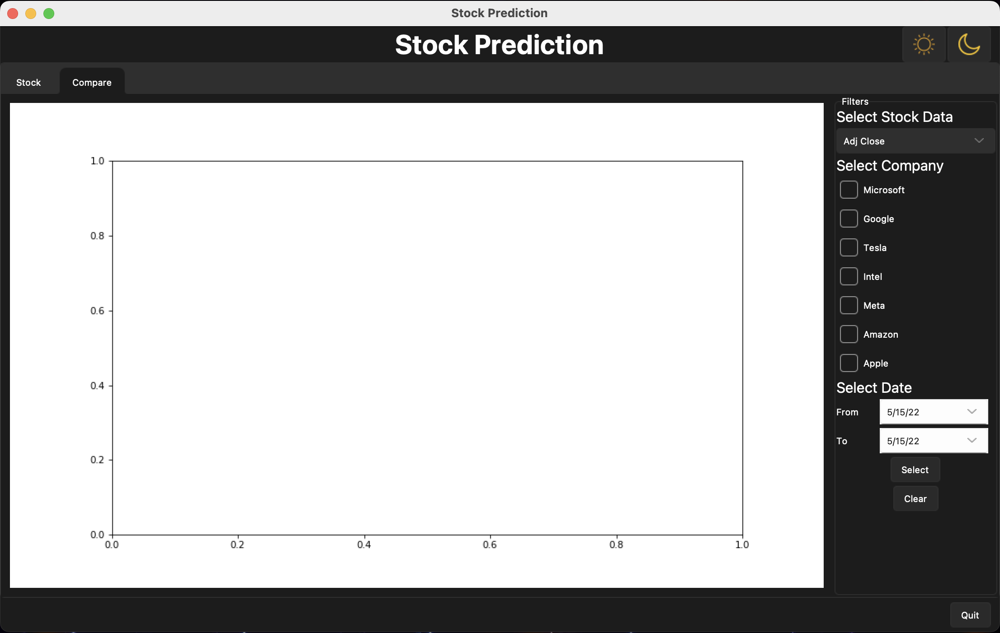
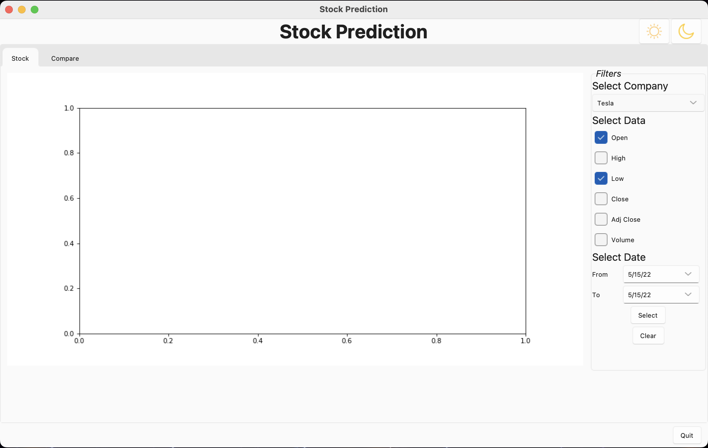
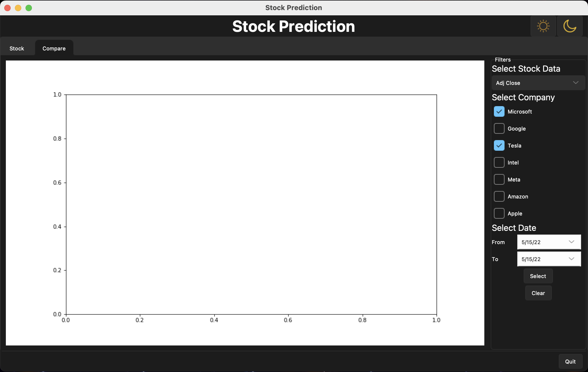
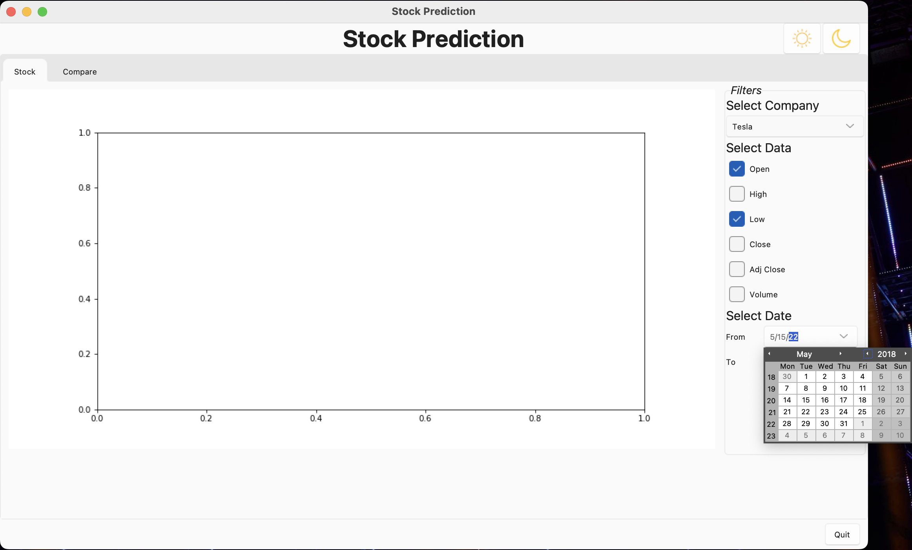
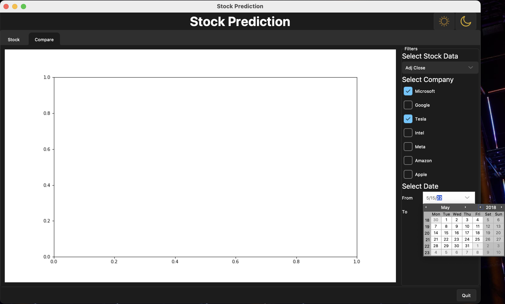
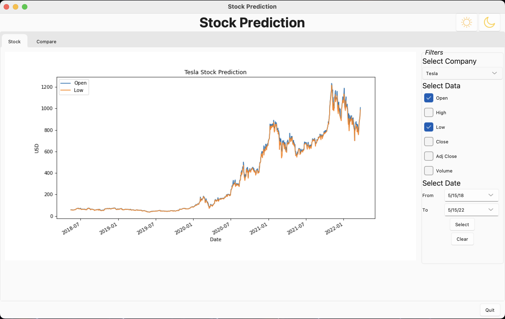
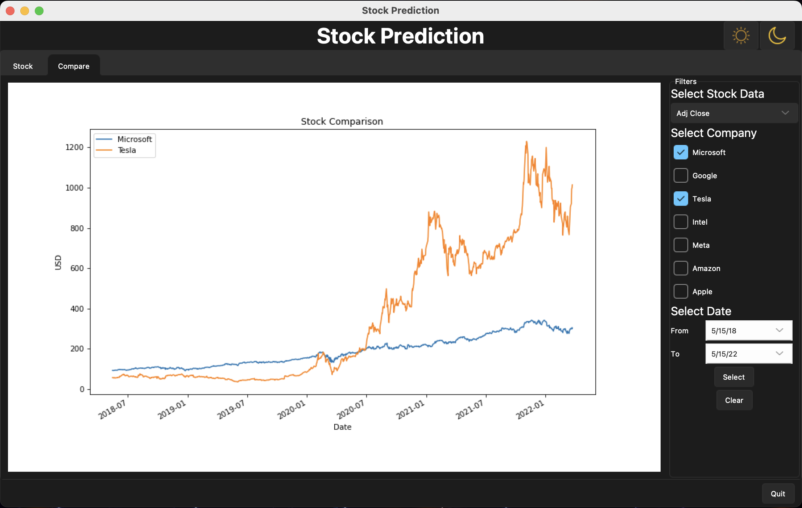
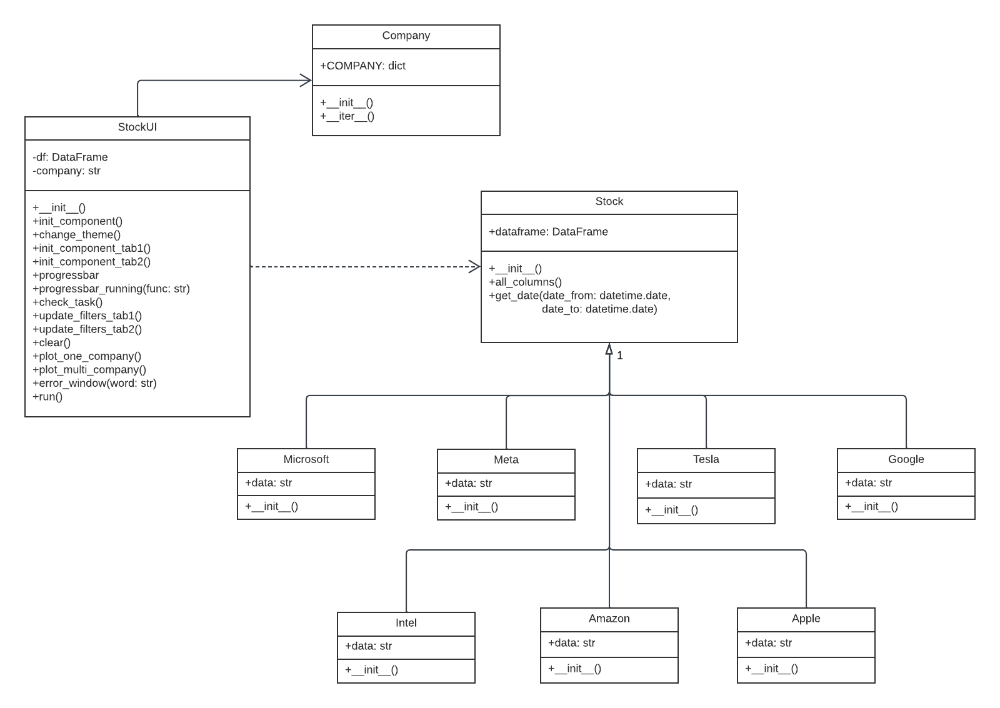

# Stock Prediction
 
## Description
This application is Stock Prediction. It will illustrate the graph from selected data and company.
Stock information including opening price, maximum price(high), minimum price(low), closing price, Adj close and volume.
Currency is in USD. In this application all company including Microsoft, Google, Tesla, Intel, Amazon, Meta and Apple.
It can add more company dataset for future use.

The application have two pages which are stock and compare. In stock page user can see stock information from one company.
And in compare page user can compare stock information with different company. User can control date-time of information 
and can change theme of application from light and dark.

You can see the video demonstration of application at [hare](https://youtu.be/hF44lTfQGbs).

| Stock Page                                                      | Compare page                                                    |
|-----------------------------------------------------------------|-----------------------------------------------------------------|
|  Start page of Stock page.                |  Start page of Compare page               |
|  Select company in combobox.              |  Select data that user want to compare.   |
|  Select data that user want to plot.      |  Select company.                          |
|  Select date.                             |  Select date.                             |
|  Click on select button to see the graph. |  Click on select button to see the graph. |

## Running the Application
Require packages for this application are
* [tkinter](https://docs.python.org/3/library/tkinter.html) : main package to make application interface.
* [pandas](https://pandas.pydata.org/docs/) : used with data from csv file.
* [matplotlib](https://matplotlib.org/stable/index.html) : used for plot the graph.
* [tkcalender](https://tkcalendar.readthedocs.io/en/stable/) : used for let user select date from calenders.
* [sv_ttk](https://github.com/rdbende/Sun-Valley-ttk-theme) : used for change theme of application.

The application can run directly in file `main.py`
 
## Design

This application consists of 4 modules and 9 classes.

#### 1. Module `stock.py`
This module contains `Stock` class which is main class for arrange data from csv file,it had functions to get all columns 
in dataframe and slice dataframe with specific date. 
The remainder class are class of company, `Microsoft`, `Google`, `Tesla`, `Intel`, `Amazon`, `Meta` and `Apple`,
they are inherited from `Stock` class.

#### 2. Module `company.py`
This module contains `Company` class that used for defined company name and class name for easy use and can add more company 
in the future.

#### 3. Module `StockUI`
This module contains `StockUI` class which is show interface of application from tkinter. 
Use for initialize interface component and plot the graph.

#### 4. Module `main.py`
This module used for running the application.

## Design Patterns Used
Describe any design patterns you used, and how they are used in your application.

* **Observer Pattern** : It is a behavioral design pattern I used the observers function call bind for button in the program. 
When user click the button it will notify event for the program and will update it filters, change theme or quit the program.
* **Iterator Pattern**: It is a behavioral design pattern I used for iterate company in dictionary (module `company.py`) 
to get company name and class.
* **Template Method** : It is a behavioral design pattern I used in module `stock.py` to let base class which is Stock class
that have it own function and let subclass which are classes for company use it base class method.

 
## Other Information
I used `tkcalender` package for let user select date from calenders or type date by yourself. 
It is easier to get datetime for use with pandas dataframe, no need to select date in dropdown combobox or other method.

The next one is `sv_ttk` package or Sun-Valley-ttk-theme. I used for change the theme of tkinter to make application 
look better.